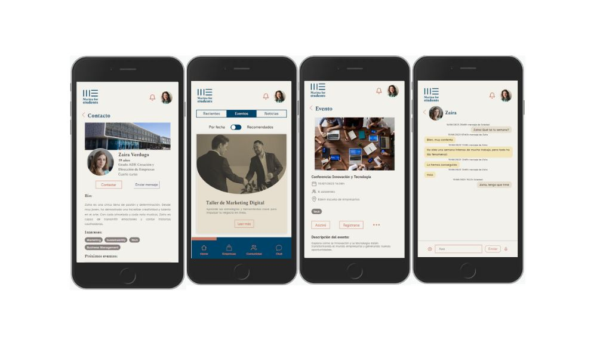

#  Marina for Students 🌊
  
 The objective of this course project was to create an app for the students of Edem Escuela de Empresarios to keep up to date with everything happening in Marina de Empresas and communicate with each other, the school and startups at the Lanzadera accelerator.

 This project was created as a two-week sprint together with a team from **data science**, 
**cybersecurity** and **UX/UI**.

### This reporitory contains the backend for the project. The frontend can be found at

[Marina for Students frontend ](#)

## 🖥️Tech

The backend was created with 

- NodeJs 
- Express
- Mongoose
- MongoDB Atlas
- Railway for deployment

## 📜Dependencies

- axios
- bcryptjs
- cors
- dotenv
- jsonwebtoken
- multer
- nodemailer
- socket.io

## 🔬 Points of interest 

Register has several validations and password is encrypted. User is sent a confirmation email.

Login sessions are secured with tokens.

The backend communicates on certain endpoints with an API of data science to filter out bad language posted and to filter events according to an algorithm that analyses the users interests.

Some endpoints also serve data science's database for the analysis of data.

Seeders have been used in a variety of ways, most notably to bring a large number of false data from data science API to populate the database.

WebSocket technology has been used to implement an instant chat feature.

## ✌🏽 Team Full Stack 

- [Kbastamow](https://github.com/kbastamow)
- [Jllanas1986](https://github.com/jllanas1986)
- [Amsiceza](https://github.com/amsiceza)
- [VolodymyrKolomiets](https://github.com/VolodymyrKolomiets)

